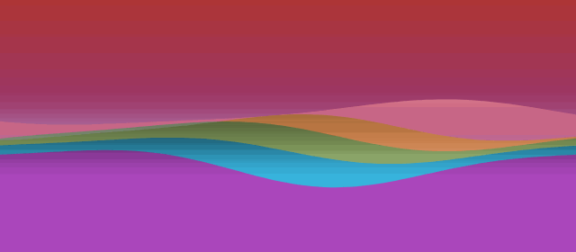
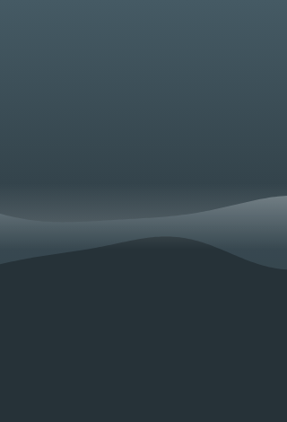
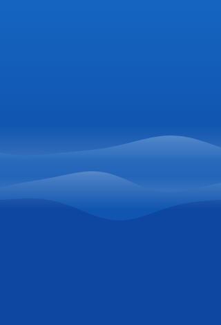
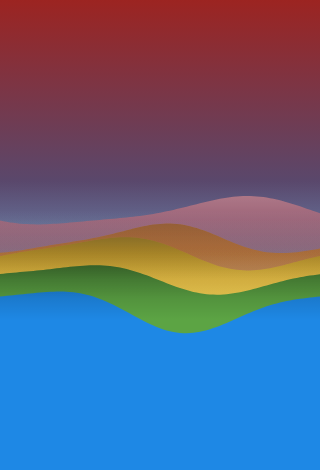
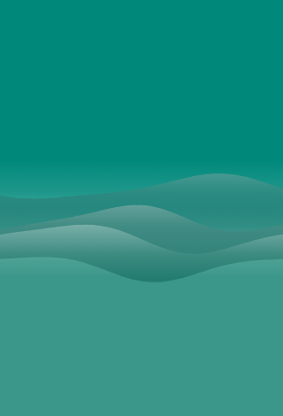
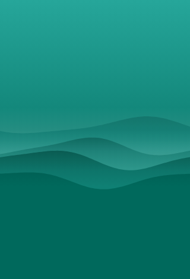
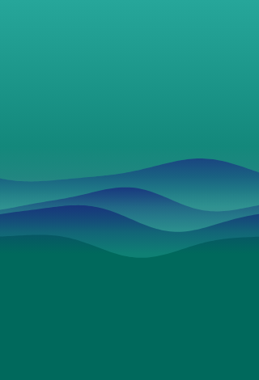

# KWave

[](https://github.com/Shyzkanza/KWave/actions/workflows/ci.yml)
[](https://central.sonatype.com/artifact/red.rankorr/kwave)
[](LICENSE)
[](https://kotlinlang.org)
[](#platforms)

Animated, customizable layered wave hero backgrounds for Compose Multiplatform.

KWave draws a full-bleed stack of vertically-breathing sinusoidal wave layers on a `Canvas`, with
depth shading and a crest highlight. The waves oscillate in place: each layer swells and recedes at
its own rate, rather than marching sideways across the screen. It is theme-free. It reads no
`MaterialTheme`; every color is supplied through its own `WaveColors` API. It ships two composable
entry points: a drop-in auto composable that owns its own animation loop, and a stateless one that
is a pure function of `(phase, time)` for tests and external sync.

<p align="center">
  
</p>

| Default preset | Two-color gradient | Rainbow palette |
|:---:|:---:|:---:|
|  |  |  |
| **Solid color** | **`FromWave` shadow** | **`Custom` shadow** |
|  |  |  |

> Regenerate these locally with `./gradlew :kwave:recordRoborazziDebug` (stills) and
> `./gradlew :sample:generateGif` (the animation).

---

## Platforms

| Android | iOS | JVM / Desktop |
|:-------:|:---:|:-------------:|
|    ✅    |  ✅  |       ✅       |

iOS is shipped as `iosArm64` + `iosSimulatorArm64`. The JVM target powers a Compose Desktop
[sample](#sample) and the fast unit tests.

---

## Installation

KWave is published to Maven Central as `red.rankorr:kwave`. The version shown in the
snippets below is an example. The Maven Central badge at the top always reflects the
latest published version; use that.

### Version catalog (`gradle/libs.versions.toml`)

```toml
[versions]
kwave = "0.1.0"

[libraries]
kwave = { module = "red.rankorr:kwave", version.ref = "kwave" }
```

```kotlin
// build.gradle.kts (Kotlin Multiplatform module)
kotlin {
    sourceSets {
        commonMain.dependencies {
            implementation(libs.kwave)
        }
    }
}
```

### Plain Gradle

```kotlin
// build.gradle.kts
dependencies {
    implementation("red.rankorr:kwave:0.1.0")
}
```

> Snapshots resolve from `https://central.sonatype.com/repository/maven-snapshots/`. Add that
> repository to your `dependencyResolutionManagement` while KWave is pre-release; tagged releases
> resolve straight from `mavenCentral()`.

---

## Quick start

The drop-in `KWave` owns its animation loop. Pass `Modifier.fillMaxSize()` for a full-screen
background and you are done:

```kotlin
import androidx.compose.foundation.layout.fillMaxSize
import androidx.compose.ui.Modifier
import red.rankorr.kwave.KWave

@Composable
fun Hero() {
    KWave(modifier = Modifier.fillMaxSize())
}
```

That uses `WaveConfig.Default`, a neutral blue-grey preset. The drop-in runs its own loop, so you
do not advance any clock yourself. The waves breathe in place (swelling and receding) without
sliding sideways. Everything below customizes it.

> **Sizing:** KWave honors the `modifier` you pass verbatim; it never forces `fillMaxSize()`
> internally. For a full-bleed background pass `Modifier.fillMaxSize()`; for a bounded banner pass
> e.g. `Modifier.fillMaxWidth().height(220.dp)`.

---

## Customization

### Colors

KWave is theme-free; you choose colors through `WaveColors`, built only through its factories.

**Simple two-color gradient.** Back layers lean toward `top`, front layers toward `bottom`:

```kotlin
import androidx.compose.ui.graphics.Color
import red.rankorr.kwave.WaveColors
import red.rankorr.kwave.WaveConfig

val ocean = WaveConfig.generate(
    waveCount = 3,
    colors = WaveColors.gradient(top = Color(0xFF1565C0), bottom = Color(0xFF0D1B2A)),
)

KWave(config = ocean, modifier = Modifier.fillMaxSize())
```

**Rainbow palette.** The rainbow rides the wave fills: each layer is tinted by sampling the
palette at its depth, so every layer carries a distinct hue. The background is not the full
saturated palette; it is a muted two-stop wash darkened from the palette extremes, so the colorful
waves stay the subject rather than competing with a loud sky:

```kotlin
val rainbow = WaveConfig.generate(
    waveCount = 5,
    colors = WaveColors.palette(
        listOf(
            Color(0xFFFF5252),
            Color(0xFFFFB300),
            Color(0xFF66BB6A),
            Color(0xFF29B6F6),
            Color(0xFFAB47BC),
        ),
    ),
)
```

A single flat color is available too. So the same-color waves do not vanish into a same-color
background, `solid()` ramps the per-layer fill by depth (slightly darker at the back, lighter at
the front); auto per-layer alpha adds further separation on top:

```kotlin
val flat = WaveColors.solid(Color(0xFF263238))
```

> An empty `palette([])` falls back to a neutral color, and `palette(listOf(c))` behaves like
> `solid(c)`. A `gradient(top, bottom)` whose two colors are equal also routes through `solid()`, so
> a monochrome gradient stays visible the same way.

### Shadow modes

`ShadowMode` controls both the depth shadow band below each crest and the luminous highlight lip
above it. The default, `Auto`, adapts per layer to the local wave color so one mode looks correct
over light and dark palettes alike.

```kotlin
import red.rankorr.kwave.ShadowMode

// Default: per-layer black/white by luminance (light wave -> dark shadow, dark wave -> light).
WaveConfig.generate(colors = ocean.colors, shadow = ShadowMode.Auto)

// Shadow = the layer's own color darkened; highlight = it lightened.
WaveConfig.generate(colors = ocean.colors, shadow = ShadowMode.FromWave)

// Flat fills only: no shadow band, no highlight lip.
WaveConfig.generate(colors = ocean.colors, shadow = ShadowMode.None)

// Explicit color + alpha (coerced into [0, 1]) for every layer. The alpha drives the rendered
// shadow band's peak opacity (here a softer 0.3).
WaveConfig.generate(colors = ocean.colors, shadow = ShadowMode.Custom(Color.Black, alpha = 0.3f))
```

### waveCount / crests / harmonic / spacing / variation / gradientEnd

`WaveConfig.generate` builds a coherent stack without hand-tuning each layer:

```kotlin
val config = WaveConfig.generate(
    waveCount = 4,       // number of layers, coerced to >= 1
    crests = 1.5f,       // relative crest density per layer (1 = baseline; higher = more, tighter)
    harmonic = 0.25f,    // crest roughness; 0 = clean rounded sine, higher = choppier/less regular
    spacing = 1f,        // vertical spread of the layers; < 1 overlaps them more, > 1 separates
    amplitude = 0.04f,   // base peak displacement as a fraction of height
    variation = 0.4f,    // per-layer pseudo-random jitter in [0, 1]; 0 = smooth/uniform
    colors = ocean.colors,
    shadow = ShadowMode.Auto,
    gradientEnd = 0.78f, // vertical fraction at which the background gradient ends
    // seed = 0,         // advanced; leave at 0 unless you need a reproducible re-roll (see below)
)
```

The generator auto-distributes each layer's static horizontal phase offset, auto-assigns depth-based
alpha (back transparent → front opaque), adds per-layer breathing, and samples each layer's tint
from `colors`. On top of the smooth back→front gradient, every per-layer property gets a
deterministic, seeded pseudo-random jitter scaled by `variation`, so the layers undulate out of sync
instead of moving as one rigid block. `crests` and `harmonic` together shape the crests: `crests` is
a *relative density* (`1` = baseline, higher packs more and tighter crests) rather than a literal
crest count. Its twin, `harmonic`, is the crest *roughness* (`0` is a clean rounded sine, higher
mixes in more of the second harmonic for choppier, less regular crests). `spacing` controls how much
the layers overlap vertically: a smaller value bunches them together, a larger one separates them.
`gradientEnd` sets where the background gradient ends, so you no longer need to rebuild a second
`WaveConfig` just to tune it.

> **`seed` (advanced).** The jitter is a pure function of `seed`, so the same arguments always yield
> the exact same configuration. Leave `seed` at its default `0` unless you need a reproducible
> re-roll: a different layout, or pinning a screenshot test. It is the last parameter for that
> reason.

---

## Advanced

### Low-level layers: `WaveLayerSpec`

For full control, build the `WaveConfig` from your own immutable list of `WaveLayerSpec`. Every
value is coerced into a valid range at construction (a negative `amplitude` becomes `0`, a
`baseFrac` above `1` is clamped, etc.), so invalid input can never reach the renderer.

```kotlin
import androidx.compose.ui.graphics.Color
import red.rankorr.kwave.WaveColors
import red.rankorr.kwave.WaveConfig
import red.rankorr.kwave.WaveLayerSpec
import kotlinx.collections.immutable.persistentListOf

val config = WaveConfig(
    layers = persistentListOf(
        // Back layer: pure sine (harmonic = 0), semi-transparent.
        WaveLayerSpec(baseFrac = 0.45f, amplitude = 0.035f, speed = 0.7f, crests = 0.8f, harmonic = 0f),
        // Front layer: a touch of 2nd-harmonic for a less regular crest, opaque.
        WaveLayerSpec(baseFrac = 0.62f, amplitude = 0.030f, speed = 1.0f, crests = 0.9f, harmonic = 0.25f),
    ),
    colors = WaveColors.gradient(Color(0xFF455A64), Color(0xFF263238)),
)
```

`WaveLayerSpec` is a regular `@Immutable` class (no `data class` `copy()`), but exposes `withTint`
and `withAlpha` for the two most common targeted tweaks:

```kotlin
val tinted = layer.withTint(Color(0xFF80DEEA)).withAlpha(0.6f)
```

### Stateless overload: `KWave(config, phase, time)`

A pure, deterministic function of `(phase, time)` with no internal animation state. Here `phase` is
the horizontal phase of every layer (constant for in-place breathing, or a value you drive for
deliberate horizontal translation) and `time` advances the per-layer amplitude breathing. Drive it
yourself for screenshot tests or to advance time however you like:

```kotlin
import androidx.compose.runtime.getValue
import androidx.compose.runtime.mutableFloatStateOf
import androidx.compose.runtime.remember
import androidx.compose.runtime.withFrameNanos

@Composable
fun ControlledWave() {
    val elapsed = remember { mutableFloatStateOf(0f) }
    LaunchedEffect(Unit) {
        var last = 0L
        while (true) withFrameNanos { now ->
            if (last != 0L) elapsed.floatValue += (now - last) / 1_000_000_000f
            last = now
        }
    }
    KWave(
        config = WaveConfig.Default,
        // Hold phase constant so the waves breathe in place; drive `time` to animate the breathing.
        phase = 0f,
        time = elapsed.floatValue,
        modifier = Modifier.fillMaxSize(),
    )
}
```

### Deliberate horizontal translation: pager / scroll

The waves never drift sideways on their own; the only ambient motion is the in-place breathing. When
you *want* a deliberate horizontal translation (e.g. a hero that follows a pager), feed that signal
through `phaseShift`. The drop-in `KWave` reads it on every recomposition, so a pager offset or
scroll position flows straight into the wave's horizontal phase without restarting the loop:

```kotlin
val pagerState = rememberPagerState { pageCount }

KWave(
    modifier = Modifier.fillMaxSize(),
    // Each page deliberately nudges the waves sideways; the in-place breathing keeps running underneath.
    phaseShift = (pagerState.currentPage + pagerState.currentPageOffsetFraction) * 0.5f,
)
```

Other knobs on the drop-in overload:

- `speed` sets the breathing-tempo multiplier (how fast the layers bob in place). Default `1`.
- `phaseShift` is a live external phase signal for deliberate horizontal translation. Default `0`.
- `isPlaying = false` freezes the animation on the current frame.
- `respectReducedMotion` (default `true`): when the system reduce-motion setting is on, KWave
  renders a single static frame instead of starting the loop.

The drop-in overload is lifecycle-aware (it pauses below `STARTED` and resumes without a time jump)
and randomizes its initial phase per instance, so several `KWave`s on one screen do not breathe in
lockstep.

---

## Sample

A Compose Desktop sample app doubles as a live visual test harness. It has sliders for `waveCount`,
`crests`, `harmonic` (a "Roughness" slider next to "Crests"), `spacing`, `amplitude`, `variation`,
`speed`, `gradientEnd`, a "Randomize layout" button that bumps the `seed`, plus a shadow-mode
selector and a gradient/rainbow color switch:

```bash
./gradlew :sample:run
```

The sample is not published.

---

## Roadmap

Planned for a future 1.x release (**not yet implemented**):

- **Vertical flip / top-anchor.** Today the fill is always bottom-anchored (waves rise from the
  bottom of the canvas). A planned option will let the waves anchor to the top of the canvas and
  fill upward, for headers and inverted hero layouts.

---

## Contributing

Contributions are welcome. See [CONTRIBUTING.md](CONTRIBUTING.md) for the build, test, detekt, and
`apiCheck` workflow. The public API surface is tracked by the binary-compatibility-validator; any
intentional change to it must update the committed `api/` dump (`./gradlew apiDump`).

---

## License

```
Copyright 2026 Jessy Bonnotte (Shyzkanza)

Licensed under the Apache License, Version 2.0 (the "License");
you may not use this file except in compliance with the License.
You may obtain a copy of the License at

    https://www.apache.org/licenses/LICENSE-2.0

Unless required by applicable law or agreed to in writing, software
distributed under the License is distributed on an "AS IS" BASIS,
WITHOUT WARRANTIES OR CONDITIONS OF ANY KIND, either express or implied.
See the License for the specific language governing permissions and
limitations under the License.
```

See [LICENSE](LICENSE) for the full text.
