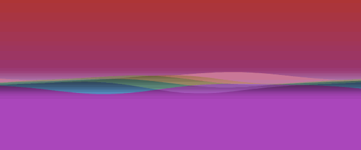
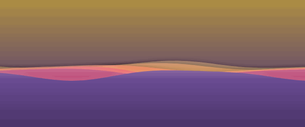
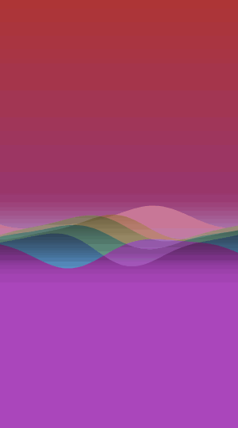
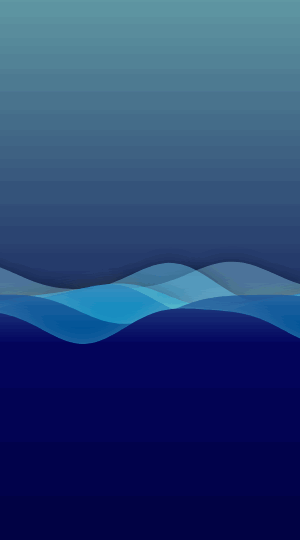
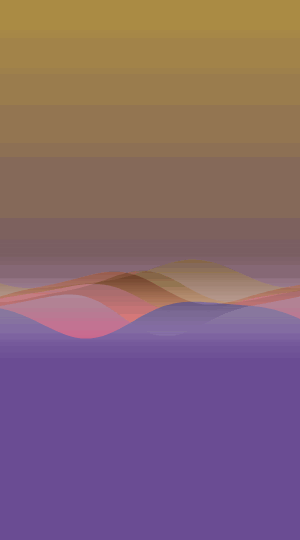

# KWave gallery

Animated previews and preset stills. Back to the [README](../README.md).

> These GIFs are short looped previews: they are sped up and use a back-and-forth (ping-pong) loop,
> so the motion can look a bit abrupt at the loop seam. The live animation is slow and continuous:
> the layers breathe, their crests sway gently, and the surface drifts sideways with a touch of
> parallax.

## Animated, landscape

| Rainbow | Ocean | Sunset |
|:---:|:---:|:---:|
|  |  |  |

## Animated, portrait

| Rainbow | Ocean | Sunset |
|:---:|:---:|:---:|
|  |  |  |

These weave-style previews use a tight stack (`spacing = 0.4`), a lower `amplitude`, and the
per-layer phase offset so the wave lines cross each other. See the `generateGif` task in
`sample/build.gradle.kts` for the exact `WaveConfig.generate(...)` call.

## Presets (stills)

| Default | Two-color gradient | Rainbow palette |
|:---:|:---:|:---:|
|  |  |  |
| **Solid color** | **`FromWave` shadow** | **`Custom` shadow** |
|  |  |  |

## Regenerate

```bash
./gradlew :sample:generateGif          # the animated GIFs (docs/screenshots/wave-*.gif)
./gradlew :kwave:recordRoborazziDebug  # the preset stills
```
